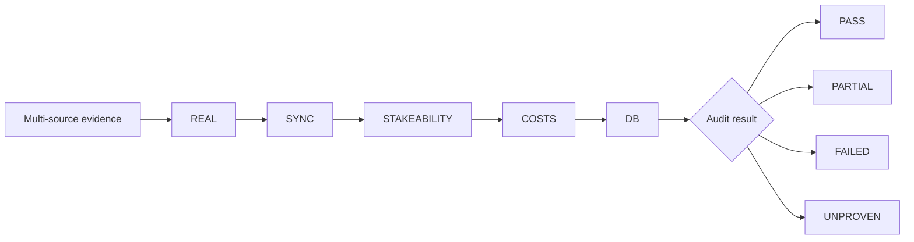

# MITRA Audit Framework

[](https://github.com/craftycoder47/mitra-audit-framework/actions/workflows/tests.yml)

A small, read-only Python framework for auditing multi-source evidence with a
**fail-closed** design.

MITRA follows one rule:

> Missing evidence must never be silently converted into certainty.

The public portfolio edition is deliberately separated from the private
production project. It contains no live connections, credentials, databases,
private endpoints, or execution capability.

## Architecture



The stages are evaluated in a fixed order:

```text
REAL -> SYNC -> STAKEABILITY -> COSTS -> DB
```

- **REAL** — are the observations genuinely about the same event and rules?
- **SYNC** — how far apart and how stale are the source observations?
- **STAKEABILITY** — does visible data have evidence of availability, acceptance and capacity?
- **COSTS** — are additional costs explicit rather than silently omitted?
- **DB** — does the stored record agree with independently reconstructed evidence?

Possible states are:

```text
PASS
PARTIAL
FAILED
UNPROVEN
```

A timing result can also retain an evidence-quality grade such as
`PARTIAL_STRONG`, `PARTIAL_TYPICAL`, or `PARTIAL_WEAK` without pretending that
timestamps alone prove simultaneous executability.

## Why this exists

Many data systems are good at producing a number and bad at explaining whether
that number is trustworthy. MITRA keeps the evidence trail visible and makes
uncertainty an explicit result.

That pattern is useful for price feeds, market-data monitoring, e-commerce
comparison, inventory aggregation, property feeds, telemetry and API-health
checks.

## What this project demonstrates

- Python package design using only the standard library at runtime
- deterministic, explainable audit logic
- defensive handling of missing and contradictory evidence
- multi-source freshness and synchronisation checks
- separation between observation and executability claims
- unit testing and regression protection
- automated CI across multiple Python versions
- secure separation between public portfolio code and private infrastructure

## Anonymised evidence window

One read-only observation window from the private research system produced:

```text
Intervals analysed:             150
Retained samples:               283
Selected multi-source samples:   48
Positive retained margins:        0

SYNC quality:
PARTIAL_STRONG:                  11
PARTIAL_TYPICAL:                 25
PARTIAL_WEAK:                    12
FAILED:                           0
UNPROVEN:                         0

Source-span p25:              5.261 s
Source-span p75:             23.047 s
Maximum-stale p25:           14.460 s
Maximum-stale p75:           32.080 s
Hard stale failure:          >60.000 s
```

The useful result here is not a positive financial outcome. It is that the
system retained enough evidence to explain what it observed and did **not**
manufacture a positive result when none was validated.

## Run the synthetic example

No third-party runtime dependency is required.

```bash
PYTHONPATH=src python -m mitra_audit.cli examples/synthetic_three_way.json
```

## Run the tests

```bash
PYTHONPATH=src python -m unittest discover -s tests -v
```

The test suite covers margin reconstruction, event mismatch, hard staleness,
missing timing evidence, database disagreement and fail-closed stakeability.
GitHub Actions runs the suite automatically on pushes and pull requests to
`main` across Python 3.10, 3.12 and 3.13.

## Repository structure

```text
mitra-audit-framework/
├── .github/
│   └── workflows/
│       └── tests.yml
├── README.md
├── SECURITY.md
├── pyproject.toml
├── docs/
│   ├── audit-model.md
│   └── cv-project-entry.md
├── examples/
│   └── synthetic_three_way.json
├── src/
│   └── mitra_audit/
│       ├── __init__.py
│       ├── cli.py
│       └── core.py
└── tests/
    └── test_core.py
```

## Safety boundary

This public edition is intentionally **read-only and disconnected**. It does not
place transactions, connect to private infrastructure, or claim that a
mathematical opportunity is executable.

## Portfolio use

A recruiter-ready project summary is included in
[`docs/cv-project-entry.md`](docs/cv-project-entry.md).

## Status

Portfolio/research edition. The design is being developed around deterministic
checks, explicit uncertainty, reproducible evidence and safe forensic review.

## Core principle

**Evidence first. Uncertainty stays uncertainty. Never manufacture a PASS.**
